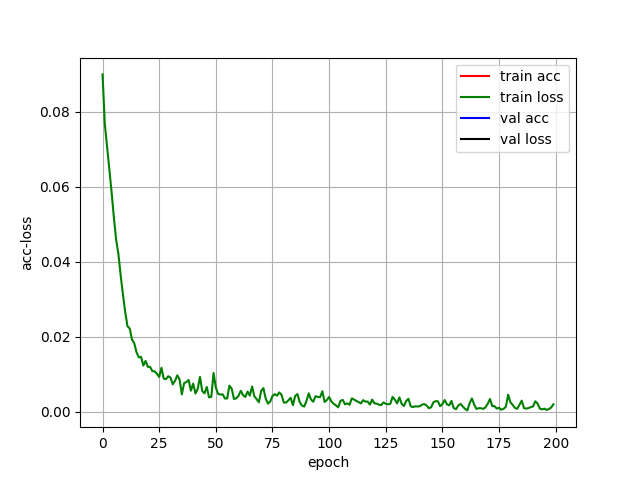

人工智能：五子棋项目 
==  
最近刚好有空，整理一下上学期《人工智能基础》课程的大作业项目  
 

### 问题一——棋子识别 
#### 方法 
监督学习算法——采用YOLO-tiny（基于keras）网上开源代码很多
#### 环境依赖 
* **python3.6**
* **NumPy**
* **SciPy**
* **matplotlib**
* **keras==2.1.5**
* **tensorflow==1.6.0**
* **tensorflow-gpu==1.8.0**
#### 效果 
个人感觉勉强可以，毕竟数据集不是自己做的，来自大佬[@Sharpiless]("https://github.com/Sharpiless/gobang-object-detection-dataset")  
`棋子不密集`   
 
  
`棋子比较密集`  
  

`棋子很密集`  

显然，棋子密集处检测效果比较不佳 

### 问题二——搜索算法
采用alpha-beta剪枝对棋局局面进行搜索  
#### 设计评估方法
具体评估方法如下所示：
1. 遍历棋盘上的每一个点，如果存在棋子，则对这个点所在的四个方向形成的四条线分别进行评估。
2. 对于具体的一条线，如下图，已选取点为中心，取该方向上前面四个点，后面四个点，组成一个长度为9的数组。

#### 评分规则
必杀情况的评分能够直接得出，评分规则如表2-1所示，最高的分为连五局面下的10000分的，最低分为-10000分；当黑棋出现连四，评分为9050分，当白棋出现连四，评分为-9050分；除了表中情况外，其余情况下针对黑棋或白棋的活三，眠三，活二，眠二的个数依次增加分数，评分为（黑棋得分 – 白棋得分）。

#### 效果
设置搜索深度为2，进行一场五子棋对局，五子棋AI取得胜利，搜索算法和评估函数有效提升棋力。

#### 搜索深度与计算时间
由于极大极小值的本质是深度优先搜索，通过调整搜索深度，可以得到搜索时间与搜索深度之间的关系。依次设置搜索深度为1，2，3，4，可以测得平均搜索时间分别为0.02s, 0.21s, 2.50s, 30.0s。根据所测得数据做出如下搜索深度与搜索时间关系图如下。 

 
  
  
  
### 问题三——基于ANN的棋局评估 
#### 思路 
将实验二中的棋局判断函数更改为人工神经网络模型，并采用进化计算对该网络模型进行学习，达到提升五子棋博弈水平的目的。 
#### 方法 
1. 基于Keras和Tensorflow深度学习框架搭建神经网络
2. 在第二问的基础上改进方案，让黑白两色AI对局200次，目的是生成训练所用的数据集。
3. 得到数据集，采用进化计算的方法训练人工神经网络。
4. 将第二问中的评估函数替换成我们所训练的神经网络，让神经网络拟合棋局评估值。 

#### 构建神经网络  
基于Keras和Tensorflow框架搭建神经网络，网络为全连接结构，含有一个输入层，四个隐含层，一个输出层，输入层有32个神经元，隐含层分别有64，128，64，8个神经元，输出层含有1个神经元。损失函数为MSE,优化器为adam。
 

 

#### 数据集格式  
在前两个实验的过程中，我所涉及的棋盘大小均为19*19。因此，在本实验中记录两个数据集，分别为x_train和y_train，两者均为文本文件。x_train的每一行为1*361大小的数组，因为19*19等于361，如图3-3所示。 
#### 训练过程 
1. 调整迭代次数epochs 
首先将epochs设置为1000次，因为1000为较大的数字，所以从1000逐渐递减，发现epochs在200至1000之间loss差距不大。
因此确定epochs为200最佳。
2. 调整batch_size 
初始化batch_size为15，随后调整batch_size从15递减至2，发现损失函数均收敛至0.17附近。本实验选取epochs为200和batch_size为10的组合

#### 结果
训练完成模型后，编写函数接口调用网络模型，对于每一个局面计算评估函数。与此时的AI对局一次，可以发现棋子AI落子合理，最终真人玩家取得胜利。 
 

下面两张图展示了epochs为200时，batch_size分别为12和10时的损失函数图，训练过程中，损失函数呈现下降趋势。其中，通过左图可以观察到batch_size等于12时，loss先将过程中震荡更大，然而并不影响最终loss均收敛之0.17左右。 

  
  

### 问题四——基于DQN的棋力提升 
#### 思路 
采用强化学习算法对实验三的人工神经网络模型进行学习，使得五子棋博弈程序的下棋水平不断提高。 
#### 训练流程 
1. 构造卷积神经网络估计V值 
2. 让黑色与白色双方互博积累经验 
3. 记录胜利的局面，并加入到数据集中 
4. V值网络每记录100个数据进行一次训练 

#### 效果
1. 强化学习前 
AI落子方式为随机落子，如图5-1所示，可以观察到棋局混乱，杂乱无章。

2. 强化学习后 
训练次数达到20此后，可以观察到AI落子下棋能力得到增强，下棋更有章法。
 

